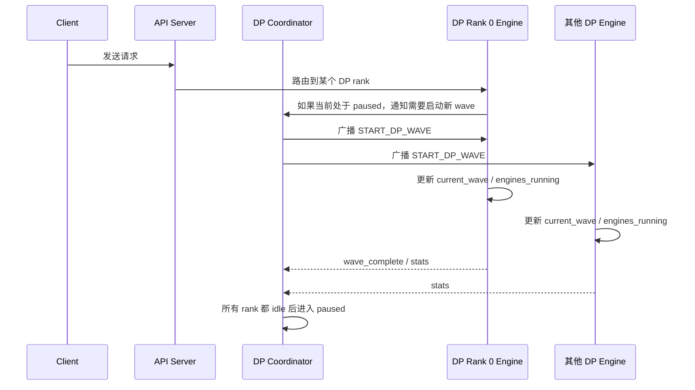

# 数据并行（DP）运行过程与关键变量说明

本文是 [Data Parallel Deployment](data_parallel_deployment.md) 的中文说明，重点解释：

- 启用 DP 后会启动哪些进程
- 请求是如何在 API Server、Coordinator、Engine Core 之间流转的
- 为什么 DP 需要 `wave`（波次）机制
- `current_wave`、`engines_running`、`pending_pause`、`ignore_start_dp_wave` 等变量分别表示什么

相关代码主要在以下文件中：

- [vllm/v1/engine/coordinator.py](../../vllm/v1/engine/coordinator.py)
- [vllm/v1/engine/core.py](../../vllm/v1/engine/core.py)
- [vllm/v1/engine/async_llm.py](../../vllm/v1/engine/async_llm.py)

## 1. DP 在 vLLM 里的角色

Data Parallel（DP）会把同一份模型复制到多个 GPU 组上，让不同的请求批次并行执行。和 Tensor Parallel（TP）不同，DP 的核心目标不是把单个请求拆开，而是让多个请求批次分散到不同的 rank 上执行。

对普通 dense 模型来说，DP rank 之间通常可以相对独立地工作。

对 MoE 模型来说，DP 还要额外处理“波次”同步问题：当某个 rank 还有请求在跑时，其他 rank 不能随意停下来，否则跨 rank 的 forward 对齐会被打乱。因此 vLLM 引入了 Coordinator 和 wave 状态机来做协调。

## 2. 启用 DP 后会出现哪些进程

启用 DP 后，典型会有下面几类进程：

| 进程 | 作用 |
| - | - |
| API Server | 接收 HTTP 请求、做输入处理、把请求路由到合适的 DP rank |
| Engine Core | 调度请求、管理 KV cache、驱动模型执行 |
| GPU Worker | 真正执行模型 forward 的 GPU 进程 |
| DP Coordinator | 维护全局 wave 状态，负责在 rank 之间广播 `START_DP_WAVE` |

在代码里，DP Coordinator 对应 [vllm/v1/engine/coordinator.py](../../vllm/v1/engine/coordinator.py)，DP Engine Core 对应 [vllm/v1/engine/core.py](../../vllm/v1/engine/core.py)。

## 3. 启动后整体会怎么走

下面是一个简化后的时序图：

### 3.1 启动阶段

1. 启动 `vllm serve` 且 `--data-parallel-size > 1` 后，每个 DP rank 都会初始化自己的 `DPEngineCoreProc`。
2. 每个 engine 会设置自己的全局 DP rank、本地 DP rank、DP group，并初始化 wave 相关状态。
3. Coordinator 进程启动后会等待所有 engine 完成订阅。
4. 所有 engine 都准备好以后，Coordinator 才会发送 `READY`，此时系统进入可服务状态。

### 3.2 请求到来阶段

当请求进入系统后，API Server 会根据当前各个 rank 的负载信息，把请求路由到一个合适的 DP rank。

如果整个 DP 集群此时已经处于 paused 状态，那么需要先把所有 engine “唤醒”到同一个 wave，再真正开始处理请求。这个唤醒动作不是每个 rank 各自完成，而是通过 Coordinator 统一广播。

### 3.3 wave 唤醒阶段

当某个 rank 收到一个新请求，但当前系统已经暂停时，会触发一次“启动 wave”的通知：

- 触发方会告诉 Coordinator：当前请求属于哪个 wave
- Coordinator 会向所有 engine 广播 `START_DP_WAVE`
- 广播里会带上两个信息：
  - `wave`：要启动的波次编号
  - `exclude_engine_index`：已经收到触发请求的那个 engine，不需要再额外唤醒一次

被广播的 engine 收到 `START_DP_WAVE` 后，如果这个 wave 不比自己当前维护的 wave 老，就会更新本地状态并进入 running。

### 3.4 运行与暂停阶段

当 wave 已经启动后，engine 会持续执行 step。

对于 MoE/DP 场景，某些 rank 可能暂时没有真正的 ready request，但它们仍需要继续执行 dummy batch 或保持 stepping，以便和其他 rank 对齐。系统会定期做一次全局判断：

- 本地还有没有 unfinished request
- 全局上所有 DP rank 是否都已经可以暂停

如果全局一致认为可以暂停，engine 会进入 pause 流程，并通知 Coordinator wave 已结束。

## 4. wave 机制到底在解决什么问题

wave 可以把 DP 的运行过程理解成一轮一轮的“全局活跃区间”。它主要解决两个问题：

1. 防止部分 rank 先停、部分 rank 还在跑，导致 MoE/DP forward 不对齐。
2. 防止过期的启动消息把已经暂停的系统重新唤醒到错误的 wave。

因此，wave 不是简单的计数器，而是一个“协调全体 rank 生命周期”的逻辑时钟。

## 5. 关键变量说明

下面按组件解释最容易混淆的变量。

### 5.1 Coordinator 侧变量

| 变量 | 位置 | 含义 |
| - | - | - |
| `current_wave` | [vllm/v1/engine/coordinator.py](../../vllm/v1/engine/coordinator.py) | Coordinator 当前认可的 wave 编号。可以把它理解为“下一轮应该从哪个 wave 开始”的逻辑时钟。wave 完成后通常会前进到 `wave + 1`。 |
| `engines_running` | [vllm/v1/engine/coordinator.py](../../vllm/v1/engine/coordinator.py) | 当前全局是否处于运行状态。`True` 表示 Coordinator 认为各个 rank 还应该继续 stepping；`False` 表示已经进入暂停态。 |
| `stats_changed` | [vllm/v1/engine/coordinator.py](../../vllm/v1/engine/coordinator.py) | 最近收到的统计信息是否发生变化。用于决定是否刷新对外发布的 load stats。 |
| `last_step_counts` | [vllm/v1/engine/coordinator.py](../../vllm/v1/engine/coordinator.py) | 最近一次用于发布的每个 engine 请求计数快照。用来避免把同一波次里乱序的 stats 反复发布出去。 |
| `last_stats_step` / `last_stats_wave` | [vllm/v1/engine/coordinator.py](../../vllm/v1/engine/coordinator.py) | 用来判断 stats 是否比上一次更新更“新”。如果收到更老的 stats，会被忽略或记录警告。 |
| `enable_wave_coordination` | [vllm/v1/engine/coordinator.py](../../vllm/v1/engine/coordinator.py) | 是否启用 wave 协调。DP + MoE 场景通常需要开启。 |

### 5.2 Engine Core 侧变量

| 变量 | 位置 | 含义 |
| - | - | - |
| `current_wave` | [vllm/v1/engine/core.py](../../vllm/v1/engine/core.py) | Engine Core 本地维护的 wave 编号。它需要和 Coordinator 保持一致，避免处理过期请求或重复启动。 |
| `engines_running` | [vllm/v1/engine/core.py](../../vllm/v1/engine/core.py) | 当前 engine 是否应该继续 stepping。`False` 时表示 engine 进入暂停路径。 |
| `step_counter` | [vllm/v1/engine/core.py](../../vllm/v1/engine/core.py) | 当前 wave 内已经执行了多少 step。DP 的全局 unfinished 检查不是每一步都做，而是按这个计数节流。 |
| `pending_pause` | [vllm/v1/engine/core.py](../../vllm/v1/engine/core.py) | 本地已经决定“我要停了”，但还在等待其他 DP rank 一起确认。它是两阶段暂停协议里的第一阶段标志。 |
| `ignore_start_dp_wave` | [vllm/v1/engine/core.py](../../vllm/v1/engine/core.py) | 当全体 rank 已经达成暂停共识后，旧的 `START_DP_WAVE` 可能已经过时。这个标志就是用来忽略这些过期消息的。 |
| `dp_rank` | [vllm/v1/engine/core.py](../../vllm/v1/engine/core.py) | 全局 DP rank。它决定当前进程在整个 DP 拓扑中的身份。 |
| `dp_size` | [vllm/v1/engine/core.py](../../vllm/v1/engine/core.py) | 全局 DP 总 rank 数。 |
| `local_dp_rank` | [vllm/v1/engine/core.py](../../vllm/v1/engine/core.py) | 当前节点内的本地 rank 编号。多节点部署时尤其重要。 |
| `last_counts` | [vllm/v1/engine/core.py](../../vllm/v1/engine/core.py) | 上一次发布的请求统计快照，用于避免重复发送相同统计信息。 |

### 5.3 请求 / 消息相关变量

| 名称 | 含义 |
| - | - |
| `START_DP_WAVE` | Coordinator 向 engine 广播的唤醒消息。它告诉所有 rank：某个新 wave 需要开始了。 |
| `wave_complete` | engine 向 Coordinator 反馈的完成信号，表示当前 wave 已经结束并可以进入下一轮。 |
| `start_wave` | 当某个 engine 收到一个属于“更老 wave”的请求时，向前端/协调路径发出的启动提示，帮助系统进入正确的 wave。 |

## 6. 两阶段暂停协议

DP 的暂停不是“一次判断就立刻停”，而是一个两阶段协议。

### 阶段 1：本地声明要暂停

当某个 engine 发现自己已经没有需要继续执行的工作时，会先把：

- `pending_pause = True`
- `engines_running = True`

这样做的目的不是“继续跑业务”，而是强制 engine 保持 stepping，直到它能进入下一步全局同步点。

### 阶段 2：全局一致后正式暂停

在 `_has_global_unfinished_reqs()` 中，系统会周期性地做全局同步判断。只有当所有 DP rank 都确认自己已经可以停下来时，才会真正进入暂停态，并把 `ignore_start_dp_wave` 打开。

这一步很关键，因为它可以避免以下竞态：

- 某个 rank 已经暂停
- 另一个 rank 还在处理旧请求
- 一个过期的 `START_DP_WAVE` 又把暂停中的 rank 唤醒

## 7. 代码里的几个关键判断

### 7.1 `current_wave` 为什么会前进

在 Coordinator 里，收到 `wave_complete` 后会执行“当前 wave + 1”的逻辑。这个设计意味着：

- `current_wave` 表示当前系统认可的波次位置
- 一旦一个 wave 正式结束，就把逻辑时钟推进到下一轮

### 7.2 为什么 `START_DP_WAVE` 要带 `exclude_engine_index`

触发请求的那个 engine 已经知道自己有新活要干，不需要再被自己唤醒一次。

因此 Coordinator 广播时要排除它，避免重复通知和不必要的状态抖动。

### 7.3 为什么要做“dummy batch”

在 MoE + DP 场景里，哪怕某个 rank 当前没有真实请求，它也可能必须继续参与执行，以便：

- 保证全局 forward 对齐
- 保证 all-reduce / wave 同步点能被所有 rank 到达

这就是 dummy batch 存在的原因。

## 8. 常见部署参数的含义

如果你在看启动命令，下面这些参数最值得关注：

| 参数 | 作用 |
| - | - |
| `--data-parallel-size` | 全局 DP 总大小，也就是一共有多少个 DP rank。 |
| `--data-parallel-size-local` | 当前节点上部署多少个 DP rank。多节点时用于切分本节点资源。 |
| `--data-parallel-start-rank` | 当前节点负责的第一个全局 DP rank。 |
| `--data-parallel-rank` | 当前进程对应的全局 DP rank。外部负载均衡或分布式部署时最重要。 |
| `--api-server-count` | API Server 进程数。它影响请求路由和前端吞吐。 |
| `--data-parallel-external-lb` | 由外部负载均衡器来分发请求。 |
| `--data-parallel-hybrid-lb` | 混合模式：每个节点内部自管，再由外部 LB 分发节点级流量。 |
| `--data-parallel-multi-port-external-lb` | 多端口外部负载均衡模式，适合更细粒度的 rank 暴露。 |
| `--data-parallel-supervisor-port` | 多端口外部负载均衡模式下，Supervisor 监听的端口。 |

## 9. 一个最小的理解方式

如果只记住一句话，可以把 DP 的运行过程理解成：

> API Server 负责收请求，Coordinator 负责定全局波次，Engine Core 负责跑波次，wave_complete 负责切换下一轮。

而这四个状态变量是最核心的：

- `current_wave`：现在是第几轮
- `engines_running`：现在该不该继续跑
- `pending_pause`：我已经准备停了，但还没和大家统一
- `ignore_start_dp_wave`：旧唤醒信号别再来打扰我了

## 10. 和英文文档的关系

如果你还想看更偏部署方式、命令行示例和负载均衡模式的说明，可以继续参考原始英文文档 [Data Parallel Deployment](data_parallel_deployment.md)。
