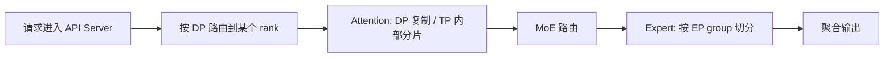

# MoE 模型中的 DP Attention + EP 中文总结

这篇文档总结 vLLM 在 MoE 模型中常见的一种部署方式：**Attention 使用 Data Parallel（DP）复制，Expert 使用 Expert Parallel（EP）切分**。

这个模式常见于 DeepSeek、Qwen-MoE 一类模型。它的核心目标是：

- 让 attention 层在多个 DP rank 上并行处理不同请求
- 让 expert 层在更大的 EP group 上分片，提高专家计算的局部性和吞吐
- 在需要时配合 DP Coordinator、all2all backend 和 DBO 进一步优化性能

相关说明可继续参考：

- [Data Parallel Deployment](data_parallel_deployment.md)
- [Expert Parallel Deployment](expert_parallel_deployment.md)
- [Parallelism and Scaling](parallelism_scaling.md)

## 1. 先理解这个组合是什么意思

在 MoE 模型里，通常可以把一个 forward 拆成两类逻辑：

- **Attention 层**：更像“公共计算”，适合按 DP 复制后并行处理不同请求批次
- **Expert 层**：更像“专家路由计算”，适合按 EP 把不同 expert 分布到不同 GPU 上

所以 DP Attention + EP 的含义可以简化成：

> attention 走 DP，expert 走 EP。

这和“只做 DP”或“只做 TP”不一样。它是把不同层用不同并行策略分别处理。

## 2. 相关进程与核心函数

下面先按进程列出最重要的函数，后面再按一次请求的生命周期把它们串起来。

### 2.1 Coordinator 进程

Coordinator 负责维护全局 wave、统计各个 rank 的负载、在必要时广播 `START_DP_WAVE`。

| 函数 | 作用 |
| - | - |
| `DPCoordinator.__init__()` | 创建协调器进程对象，准备 ZMQ 上下文和 engine 状态表。 |
| `DPCoordinatorProc.run_coordinator()` | 协调器子进程入口。 |
| `DPCoordinatorProc.process_input_socket()` | 协调器主循环。接收前端请求、接收 engine 输出、维护 `current_wave` / `engines_running`。 |
| `DPCoordinatorProc._send_start_wave()` | 把 `(wave, exclude_engine_index)` 封装成 `START_DP_WAVE` 并广播给所有 engine。 |
| `DPCoordinatorProc._get_engine_counts()` | 汇总每个 engine 的 `(waiting, running)` 计数。 |

### 2.2 Engine Core 进程

Engine Core 负责调度和执行。MoE + DP 场景下，它还要参与 wave 协调。

| 函数 | 作用 |
| - | - |
| `DPEngineCoreProc._init_data_parallel()` | 初始化 DP 组、DP rank 和本地 rank。 |
| `DPEngineCoreProc.add_request()` | 收到请求时更新 wave，并在需要时通知前端启动新 wave。 |
| `DPEngineCoreProc.resume_scheduler()` | 从 pause 状态恢复调度，并清理 `ignore_start_dp_wave`。 |
| `DPEngineCoreProc._pause_complete()` | DP 两阶段暂停的第一阶段：声明本地准备暂停，并进入等全局一致的状态。 |
| `DPEngineCoreProc._handle_client_request()` | 处理 `START_DP_WAVE` 控制消息。 |
| `DPEngineCoreProc._maybe_publish_request_counts()` | 发布当前等待/运行统计，供 Coordinator 做负载均衡。 |
| `DPEngineCoreProc._has_global_unfinished_reqs()` | 通过 DP all-reduce 判断是否仍有未完成请求。 |
| `DPEngineCoreProc.run_busy_loop()` | Engine Core 的主忙循环。 |
| `DPEngineCoreProc.barrier()` | 测试用 barrier，等待 DP 组同步。 |

### 2.3 DeepEP / EP 后端

DeepEP 负责 expert 间的 token 交换与上下文切换，是 EP 路径里最关键的后端之一。

| 函数 | 作用 |
| - | - |
| `DeepEPHTPrepareAndFinalize.maybe_roundup_layer_hidden_size()` | 把 hidden size 向上对齐到 DeepEP 需要的传输粒度。 |
| `DeepEPHTPrepareAndFinalize.prepare_async()` | 先做可异步的 dispatch 准备，再进入 all2all 传输。 |
| `DeepEPHTPrepareAndFinalize._do_dispatch()` | 调用 `deep_ep.Buffer.dispatch()` 启动 expert token 分发。 |
| `DeepEPHTPrepareAndFinalize._receiver()` | 等待 dispatch 完成，整理 expert 输出和元数据。 |
| `DeepEPHTPrepareAndFinalize.prepare()` | 同步版 prepare，内部直接调用 `prepare_async()` 并立即等待。 |
| `DeepEPHTPrepareAndFinalize._finalize()` | 把 expert 输出做加权、聚合，并写回最终结果。 |
| `DeepEPHTPrepareAndFinalize.supports_async()` | 标记该后端支持异步 prepare/finalize。 |

## 3. 按请求生命周期看流程

把一次 MoE DP Attention + EP 的请求完整走一遍，代码路径大致如下。

### 3.1 启动阶段

1. `vllm serve` 启动后，MoE 模型会创建 DP 相关的 engine core。
2. `DPEngineCoreProc._init_data_parallel()` 初始化全局 DP 组、`dp_rank` 和 `dp_size`。
3. Coordinator 由 `DPCoordinator.__init__()` 创建，并由 `DPCoordinatorProc.run_coordinator()` 进入主循环。
4. `DPCoordinatorProc.process_input_socket()` 等待所有 engine 完成订阅后，发送 `READY`。

### 3.2 请求进入与路由

1. 请求先到 API Server。
2. API Server 根据当前负载状态把请求发到某个 DP rank。
3. 如果系统已经暂停，新请求会通过 `DPEngineCoreProc.add_request()` 或前端通知路径触发下一轮 wave。

### 3.3 Wave 唤醒

1. 当某个 engine 收到属于新 wave 的请求时，它会把本地 `current_wave` 往前推进。
2. 如果当前全局 `engines_running == False`，Coordinator 会通过 `DPCoordinatorProc._send_start_wave()` 广播 `START_DP_WAVE`。
3. 每个 engine 在 `DPEngineCoreProc._handle_client_request()` 中接收该消息，并决定是否把自己唤醒到 running 状态。

### 3.4 Attention 执行

1. Engine Core 的主循环由 `DPEngineCoreProc.run_busy_loop()` 驱动。
2. `DPEngineCoreProc._process_input_queue()` 负责先消费控制消息和请求。
3. `DPEngineCoreProc._process_engine_step()`（继承自基类）进入一次真正的模型 step。
4. 在模型内部，attention 走 DP 复制或 TP 切分的路径。

### 3.5 MoE 路由与 EP Dispatch

1. attention 产生的中间激活进入 MoE router。
2. top-k 结果和 expert map 会交给 EP 后端。
3. `DeepEPHTPrepareAndFinalize.prepare_async()` 准备 dispatch 输入。
4. `DeepEPHTPrepareAndFinalize._do_dispatch()` 调用 `deep_ep.Buffer.get_dispatch_layout()` 和 `deep_ep.Buffer.dispatch()`。
5. `DeepEPHTPrepareAndFinalize._receiver()` 等待 all2all 完成，并整理 expert 侧的输入、权重和 token 元数据。

### 3.6 Expert 计算与聚合

1. expert 侧 kernels 对本 rank 持有的 expert 进行计算。
2. `DeepEPHTPrepareAndFinalize._finalize()` 使用 `TopKWeightAndReduce` 把 expert 输出做最终聚合。
3. 输出返回到主模型路径，继续后续层或返回给调用方。

### 3.7 暂停与 wave 结束

1. 当本 wave 没有更多 unfinished request 时，`DPEngineCoreProc._pause_complete()` 会进入暂停协议第一阶段。
2. `DPEngineCoreProc._has_global_unfinished_reqs()` 通过全局 all-reduce 判断是否所有 rank 都已经可以停。
3. Coordinator 在 `DPCoordinatorProc.process_input_socket()` 收到 `wave_complete` 后，把 `current_wave` 前进到下一轮，并把 `engines_running` 置为 `False`。

## 4. 你在代码里最该跟踪的几个函数链

如果你是从调试角度看这套流程，建议优先顺着下面几条链路看：

1. **请求路由链**：API Server -> `DPEngineCoreProc.add_request()` -> `DPCoordinatorProc.process_input_socket()`
2. **唤醒链**：`DPCoordinatorProc._send_start_wave()` -> `DPEngineCoreProc._handle_client_request()`
3. **暂停链**：`DPEngineCoreProc._pause_complete()` -> `DPEngineCoreProc._has_global_unfinished_reqs()` -> `wave_complete`
4. **EP 分发链**：`DeepEPHTPrepareAndFinalize.prepare_async()` -> `_do_dispatch()` -> `_receiver()` -> `_finalize()`

如果你要定位某个问题，先看它落在哪一条链上，通常会快很多。

## 5. 拓扑关系

在 vLLM 的实现里，EP 的大小通常会自动计算为：

```text
EP_SIZE = TP_SIZE × DP_SIZE
```

其中：

- `TP_SIZE`：Tensor Parallel 的大小
- `DP_SIZE`：Data Parallel 的大小
- `EP_SIZE`：Expert Parallel 的大小

对 Attention 层来说：

- 当 `TP = 1` 时，attention 权重在各个 DP rank 之间复制
- 当 `TP > 1` 时，attention 权重在每个 DP 组内部继续做 TP 切分

对 Expert 层来说：

- expert 权重会分布到整个 EP group 中
- 在 EP 开启后，expert 层不再按普通的 TP 逻辑切分，而是按 EP 逻辑组织



## 6. 运行过程

### 3.1 请求进入系统

用户请求先进入 API Server。API Server 根据当前负载、队列长度、wave 状态等信息，把请求分配给某个 DP rank。

这里的关键点是：**DP rank 不是完全独立的**。尤其在 MoE 场景下，它们要配合 Coordinator 和全局 wave 状态一起工作。

### 3.2 Attention 阶段

Attention 层通常是“每个 DP rank 都有一份”的结构：

- 如果 `TP = 1`，attention 权重就是每个 DP rank 一份完整副本
- 如果 `TP > 1`，每个 DP group 内再做 TP 切分

这意味着 attention 阶段更偏向“请求级并行”。不同 rank 可以同时处理不同请求。

### 3.3 MoE 路由阶段

当 attention 完成后，请求进入 MoE 路由。这里会产生 top-k expert 选择，并把 token 发往对应 expert。

因为 expert 使用 EP，所以真正执行 expert 计算的 GPU 不一定和 attention 计算在同一个“逻辑位置”上。EP 的目标是让 expert 负载更均匀、更局部。

### 3.4 Expert 阶段

expert 层会在 EP group 上执行分片计算：

- 每个 expert 只持有自己负责的一部分权重
- token 会根据路由结果在 EP ranks 之间流转
- 最后再把结果聚合回来

如果启用了 DeepEP 或其他 all2all backend，token 交换会更高效，尤其适合大规模 MoE。

## 7. 关键参数解释

### 4.1 并行相关参数

| 参数 | 含义 |
| - | - |
| `--data-parallel-size` | 全局 DP 大小，也就是一共有多少个 DP rank。 |
| `--data-parallel-size-local` | 当前节点上有多少个本地 DP rank。多节点部署时非常重要。 |
| `--data-parallel-start-rank` | 当前节点负责的第一个全局 DP rank。 |
| `--tensor-parallel-size` | TP 大小。attention 层和部分模型权重会按这个维度切分。 |
| `--enable-expert-parallel` | 开启 EP，让 MoE expert 层走 expert parallel，而不是普通的 TP 切分。 |
| `--api-server-count` | API Server 进程数，用来提升前端吞吐。 |

### 4.2 EP 和通信相关参数

| 参数 | 含义 |
| - | - |
| `--all2all-backend` | 选择 expert 之间的 all2all 通信后端。 |
| `allgather_reducescatter` | 默认后端，通用性最好。 |
| `deepep_high_throughput` | 更偏 prefill，追求吞吐。 |
| `deepep_low_latency` | 更偏 decode，追求低延迟。 |
| `flashinfer_nvlink_one_sided` / `flashinfer_nvlink_two_sided` | 面向特定 NVLink 场景的后端。 |
| `--enable-dbo` | 开启 Dual Batch Overlap，用于把 MoE 的通信和计算重叠起来。 |

### 4.3 常见的 EP 侧变量

| 名称 | 含义 |
| - | - |
| `EP_SIZE` | EP 总大小，通常由 `TP × DP` 自动决定。 |
| `DP_SIZE` | 数据并行大小。 |
| `TP_SIZE` | 张量并行大小。 |
| `num_experts` | 模型中的 expert 总数。 |
| `expert_topk_ids` | 路由后每个 token 命中的 expert 编号。 |
| `expert_topk_weights` | 路由对应的权重。 |
| `expert_map` | 本 rank 上哪些 expert 可见，哪些 expert 需要映射为无效值。 |

## 8. 单机部署理解

如果是在单机多 GPU 上跑 MoE + DP Attention + EP，通常可以这样理解：

- DP 负责把请求拆到不同 rank 上
- Attention 在每个 DP rank 上复制或 TP 切分
- Expert 在整个 EP group 上切分

例如：

- `TP = 1`
- `DP = 8`
- `EP = 8`

那么 attention 是 8 份 DP 副本，expert 也是 8-way EP 切分。这样更适合“attention 走请求并行、expert 走专家并行”的 MoE 模型。

示例命令可以写成：

```bash
vllm serve deepseek-ai/DeepSeek-V3-0324 \
  --tensor-parallel-size 1 \
  --data-parallel-size 8 \
  --enable-expert-parallel \
  --all2all-backend deepep_low_latency
```

如果你的工作负载更偏 prefill，可以考虑使用更偏吞吐的 backend；如果更偏 decode，则优先考虑低延迟 backend。

## 9. 多节点部署理解

多节点时，DP Attention + EP 的本质不变，只是 rank 分散到了不同机器上。

你通常需要关心下面这些点：

1. 每个节点负责哪一段全局 DP rank
2. 每个节点上的 `data_parallel_size_local` 是多少
3. `data_parallel_start_rank` 怎么设置
4. 所有节点是否使用同样的 `--enable-expert-parallel` 和 `--all2all-backend`
5. `data_parallel_address` 和 `data_parallel_rpc_port` 是否可达

如果你使用 headless 模式，非主节点通常只负责 worker；主节点负责接收请求和调度。

## 10. 这个模式和普通 DP 有什么区别

普通 DP 更像“整模型复制多份，然后做请求分发”。

DP Attention + EP 更像“层级化拆分”：

- attention 层按 DP 做请求并行
- expert 层按 EP 做专家并行
- Coordinator 负责处理 wave、暂停与唤醒
- all2all backend 负责专家之间的通信效率

它适合 MoE 模型，因为 MoE 的专家部分通常是最值得单独优化的地方。

## 11. 适合关注的变量和判断

如果你在看日志或排查问题，最值得关注的是这些判断：

- `enable_expert_parallel` 是否真的开启
- `EP_SIZE` 是否等于预期的 `TP × DP`
- attention 是否按预期复制或切分
- expert 路由是否均衡
- all2all backend 是否和工作负载匹配
- 是否启用了 DBO 来重叠通信和计算

## 12. 常见注意点

- DP Attention + EP 并不是“所有层都走同一种并行策略”，它是按层拆分的混合策略
- 如果 expert 分布非常偏斜，可能需要关注 EPLB
- 如果网络条件较差，跨节点 all2all 的收益会明显下降
- 如果 workload 偏 decode，低延迟 backend 往往更合适

## 13. 一句话总结

在 MoE 模型里，DP Attention + EP 可以理解为：

> attention 负责按请求扩展吞吐，expert 负责按专家切分计算，Coordinator 和 all2all backend 负责把这两部分协调起来。
